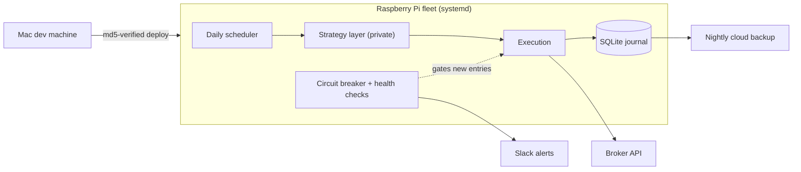

# trading-agent-ops

Production operations infrastructure for autonomous LLM trading agents running
24/7 on Raspberry Pi hardware.

> **Provenance.** This is a public, sanitized extraction of a private system
> that has been in continuous development since spring 2026 and runs live
> (paper) trading sessions every market day. The strategy layer — screening
> logic, decision prompts, learned configuration, and risk parameters — is
> closed-source and stays that way. What's public here is the part that makes
> an autonomous agent survivable in production: safety systems, deployment,
> monitoring, journaling, and the test harness around them. Modules are being
> ported over incrementally (see [docs/ROADMAP.md](docs/ROADMAP.md)); numeric
> defaults in this repo are illustrative examples, not the production values.

## The system this comes from

Multiple LLM-assisted swing-trading agents, each an independent strategy
process on its own Raspberry Pi, coordinated by nothing but a shared ops
playbook. Each agent runs a scheduled daily loop (screen → LLM evaluation →
execute → journal → reflect), self-improves through a bounded learning loop,
and is wrapped in code-enforced safety systems that the learning loop cannot
touch.

## Design principles

- **The kill switch is not learnable.** The agents rewrite their own strategy
  files and prompt configs; the circuit breaker, risk constants, and health
  checks live outside that surface, in code and environment only.
- **Fail closed for entries, fail open for exits.** If equity can't be
  fetched or halt state is unreadable, new entries are blocked — but position
  review and protective-stop maintenance never consult the breaker, so the
  system can always get *out* of a position even when it can't get in.
- **Everything is journaled, everything reconciles.** Every trade, equity
  snapshot, breaker event, and config change lands in a SQLite journal that
  a reconciliation pass checks against the broker's records.
- **Deploys are verified, not hoped.** Code ships to the Pis with md5
  comparison on every file, and agent-written state (learned configs, halt
  state, databases) is structurally excluded from sync.

## What's here so far

| Module | Purpose |
|---|---|
| [`tradeops/interfaces.py`](tradeops/interfaces.py) | Ports (protocols) for broker, journal, and notifier — the safety layer stays import-clean of any concrete SDK |
| [`tradeops/safety/circuit_breaker.py`](tradeops/safety/circuit_breaker.py) | Four-level portfolio circuit breaker: soft halt, hard halt, emergency flatten, fail-closed — with latching, self-drill, and audited manual reset |
| [`tests/`](tests/) | Unit suite with in-memory fakes for every port |

## Field notes

A few lessons this system paid for, in the currency of incidents:

- **Bundle before you upload.** A nightly `rclone copy` of a 12-file backup
  payload stalled at <1 KB/s under the cloud provider's per-file throttling
  and blew a 120s timeout — while a single tarball of the same data uploaded
  in ~5 seconds. The un-caught timeout then crashed the job scheduler, turning
  a slow upload into a spurious CRITICAL page. Fix: one archive, explicit
  timeout handling, retry, and a severity downgrade.
- **A guard is only as good as the quote it reads.** A pre-open price guard
  once "detected" a +5% gap on an entry that actually filled 0.13% from the
  reference price — the guard was reading a thin pre-open quote from a single
  exchange feed. Enforcement was moved to the execution layer (limit orders),
  where the protection is real, and the advisory guard stayed advisory.
- **Streak rules need a magnitude floor.** A "three consecutive losing days"
  halt kept tripping on sub-0.1% equity drifts (including a holiday mark).
  A losing *streak* should require material losing *days*.

## What stays private

Screening universes and logic, decision prompts, learned strategy files,
sizing and risk parameters, backtest results, and anything containing account
identifiers or live P&L. If you're evaluating this repo: that boundary is
deliberate, and holding it is part of the engineering.

## License

MIT — see [LICENSE](LICENSE).
